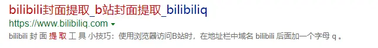

# 前言

最近重装了电脑，然后电脑上整理的 iTunes 资料库全没了。~~草~~

在整理的时候发现有一些歌曲是直接从 B 站上下载下来的，专辑封面也是从 B 站封面扒的，全没了（呜呜呜

虽然在 Bing 上一搜就有很多封面提取的网站





但是秉承着**用轮子不如造轮子**的理论(~~其实就是闲着没事~~)，我决定自己用 Python 写一个提取封面的工具

# 准备工作

既然是造轮子，那当然要先看 B 站的 API

搜了一下，发现网上公认的哔哩哔哩官方 API 文档地址是：**[http://docs.bilibili.cn/wiki](http://docs.bilibili.cn/wiki)**

但是


> 在 Github 上面找到的野生文档 [SocialSisterYi/bilibili-API-collect](https://github.com/SocialSisterYi/bilibili-API-collect)

API

获取视频信息

`https://api.bilibili.com/x/web-interface/view?bvid=BV号`

丢**[json.cn](http://json.cn)**解析一下

找到关于视频封面的`pic`字段`"pic":"http://i0.hdslb.com/bfs/archive/38ee715cfe85351c790102691d01d05007092c9e.jpg",`

那么，开搞

# Python 实现

随便写了个代码

```python
import json
import requests
import os
import sys

 主程序
if __name__ == "__main__":
    bvid = input('视频BV号:')#获取视频BV号
    info = requests.get('https://api.bilibili.com/x/web-interface/view?bvid='+bvid).text
    info = json.loads(info)
    cover = info['data'].get('pic')
    print(cover)
```


**输出成功**

> PS:《噬光者与发光体的爱情》真的好听！！！！Meumy 我吹爆！！！！

## 接下来写输出

### 先写了封面文件夹检测

```python
def mkcoverdif():
    if not os.path.isdir('cover'):
        os.mkdir('cover')
```

### 用 requests 写了图片保存的函数

```python
def imgdownload(url,name):
    cover = requests.get(url)
    with open('./cover/'+name+'.jpg', 'wb') as pic:
        pic.write(cover.content)
```

### 获取一些必要信息

```python
    cover = info['data'].get('pic')  封面地址
    title = info['data'].get('title')  视频标题
    bvid = info['data'].get('bvid')  返回的正确格式BV号
```

> 这是直接写入主程序块的

### 完整代码

```python
import json
import requests
import os
import sys
import codecs
import re

def mkcoverdir():
    if not os.path.isdir('cover'):
        os.mkdir('cover')

def imgdownload(url,name):
    cover = requests.get(url)
    with open('./cover/'+name+'.jpg', 'wb') as pic:
        pic.write(cover.content)

def av2bv(av):
    info = requests.get('https://api.bilibili.com/x/web-interface/view?aid='+av).text
    info = json.loads(info)
    if info.get('code') == 0:
        vid = info['data'].get('bvid')  返回的正确格式BV号
        return vid
    else:
        print("找不到该AV号")
        print("CODE:"+str(info.get('code'))+" MESSAGE:"+info.get('message'))
        return 1
def bvcheck(vid):
    if vid.startswith('BV',0,2) or vid.startswith('bV',0,2) or vid.startswith('Bv',0,2) or vid.startswith('bv',0,2):
        if len(vid) == 12:
            info = info = requests.get('https://api.bilibili.com/x/web-interface/view?bvid='+vid).text
            info = json.loads(info)
            if info.get('code') == 0:
                return True
            else:
                print("找不到该BV号")
                print("CODE:"+str(info.get('code'))+" MESSAGE:"+info.get('message'))
                return False


        else:
            print('这不是一个合法的BV号, BV号应为12位字符串')
            return False
    else:
        print('这不是一个合法的BV号，BV号应为 BV 开头')
        return False

def main():
    valid = True
    mkcoverdir()
    print("请选择 AV号 / BV号")
    print("1.AV号     2.BV号")
    status = input()

    if status == '1':
        vid = input('AV号:')
        vid = re.sub('av', '', vid, flags=re.IGNORECASE)
        if vid.isdigit():
            vid = av2bv(vid)
            if vid == 1:
                valid = False
        else:
            print('这不是一个合法的AV号')
            valid = False

    if status == '2':
        vid = input('视频BV号:')#获取视频BV号

    if status == '1' or status == '2':
        if valid:
            if bvcheck(vid):
                info = requests.get('https://api.bilibili.com/x/web-interface/view?bvid='+vid).text
                info = json.loads(info)
                bvid = info['data'].get('bvid')  返回的正确格式BV号
                cover = info['data'].get('pic')  封面地址d
                title = info['data'].get('title')  视频标题
                if status == '1':
                    vid = "av"+str(info['data'].get('aid')) #返回的正确格式AV号
                if status == '2':
                    vid = info['data'].get('bvid')  返回的正确格式BV号
               print(title+' - '+bvid+": "+cover)
                print('完成!')  提示一下
                print("保存文件名:"+title+' - '+vid+".jpg")
                imgdownload(cover,title+' - '+vid)  下载
    else:
        print("这不是一个合法的状态码")


 主程序
if __name__ == "__main__":
    main()
    os.system('pause')
```

> 自己加了 AV 号与 BV 号的判断，如果是 AV 号就把 AV 转换成 BV 再用 BV 手法去找封面
>
> 然后根据选择的类型进行保存

### 运行一下


**Done！**

# 后记

使用 Python 的 json 库解析了 B 站官方的 API 接口，完成了封面的下载
