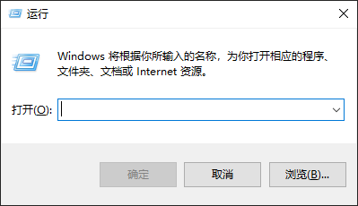

# 前言

## 我为什么选择 Hugo

Hugo 是一个使用**Go**语言编写的静态网站生成器。
长期续费一个稳定的虚拟主机的费用是昂贵的，因此我放弃了原先的**Typecho**系统，转而寻找静态博客系统。在尝试了**Hexo**、**Jekyll**后，我选择了**Hugo**，原因首先是它支持 Markdown 语法，这使得我将文章从 Typecho 迁移至 Hugo 变得容易，其次是[**Stack**](https://github.com/CaiJimmy/hugo-theme-stack)主题仅适用于 Hugo (搭建博客第一要领：好看)

## 网页托管

说起网页托管，大家第一想到的大概都是[**Github Pages**](https://pages.github.com)吧，最初我也是使用 gh 来对生成的动态页面进行托管，可长期使用下来我发现 gh pages 存在一些问题：

1. github pages 会对绑定的域名进行 cname 验证，而 Cloudflare 默认将主域名的 CNAME 拉平成 A 解析，这导致我的域名一周多了还没有通过验证
2. Github Pages 默认给每个域名申请免费的 SSL 证书，而我的一个域名出现了 SSL 证书出错的情况 😓，最后也没排查出是域名还是 gh pages 的问题
3. 可能会有 DNS 污染导致 github.io 无法访问
4. 不支持 PHP，导致我原先的一些脚本无法使用

为了解决这些问题，我在知乎游了一圈，发现了一个宝藏部署服务：[**Vercel**](https://vercel.com)

Vercel 有以下优点：

1. 访问速度比 Github Pages 快

2. 比 Github Pages 稳定

3. 自带 SSL 证书

4. 支持将域名 DNS 服务器迁移至 Vercel

# 准备工作

## 安装 Hugo

> 本文仅展示使用 Windows 安装 Hugo
>
> 本教程中使用 [**scoop**软件包管理器](https://scoop.sh/) 安装
>
> 其余方法大同小异，请自行使用搜索引擎搜索
>
> 安装 scoop，请看这篇文章：[Scoop - 一款强大的 Windows 包管理工具](/p/install-scoop/)

<code>win</code> + <code>r</code> 打开运行窗口

输入<code>Powershell</code>

在打开的窗口中输入

<code>scoop install hugo</code>

或者用以下方式安装扩展版本

<code>scoop install hugo-extended</code>

当控制台显示`'hugo' (0.92.2) was installed successfully!`时代表安装已完成

> 若选择安装拓展版本，则当显示`'hugo' (0.92.2) was installed successfully!`时代表安装已完成

> 括号内版本号以最新版本为准

## 创建站点

### 初始化站点

在控制台中输入<code>hugo new site 路径</code>新建一个站点

如<code>hugo new site E:\myblog</code>

这个命令将在 E 盘中创建一个名为 myblog 的目录并在此中创建一个新的 hugo 站点

### 安装主题

由于新站点中无主题，因此无法渲染，所以我们需要安装一个新主题

在本文中选择从 hexo 移植的[Next 主题](https://github.com/elkan1788/hugo-theme-next)

进入站点根目录后，使用 git 获取主题

`git clone https://github.com/elkan1788/hugo-theme-next.git themes/hugo-theme-next`

复制站点根目录/theme/hugo-theme-next/exampleSite 中的文件并粘贴至站点根目录后覆盖

运行<code>hugo server</code>

恭喜你，你的 hugo 博客已成功运行

# 部署

参见新博文 [使用 Vercel 托管静态网页](https://yurik.cafe/2023/use-vercel-introduction/)
