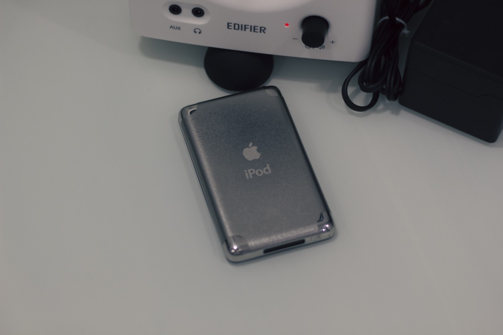
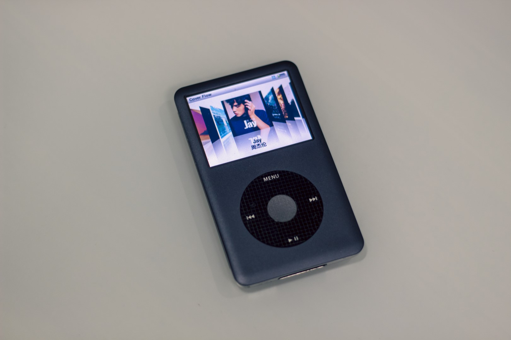
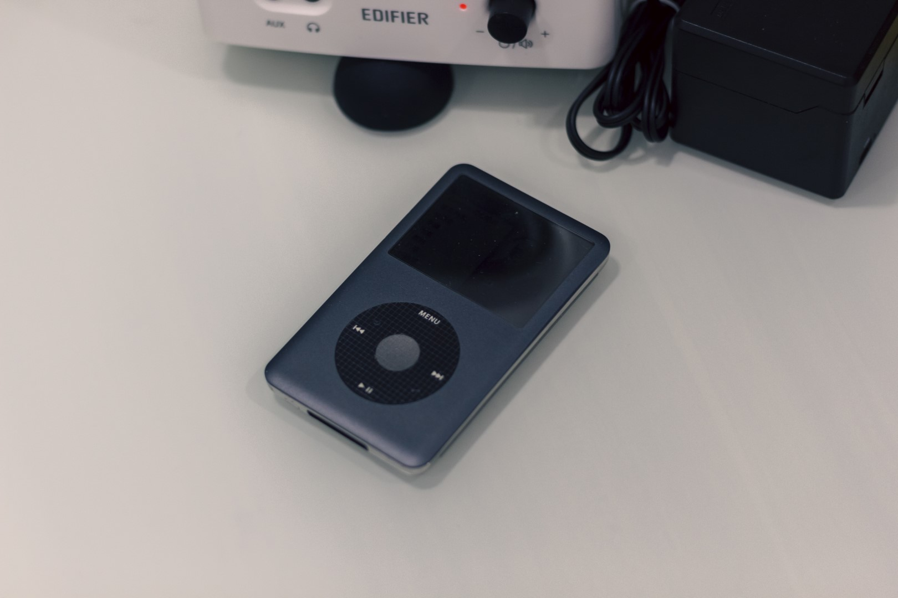
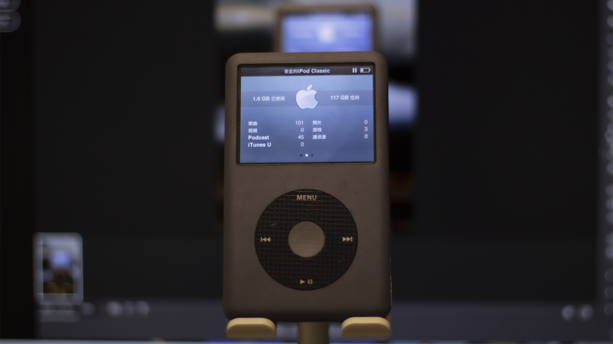

# 引言

终于下定决心写这篇文章了, 截至文章截稿，iPod Classic 陪着我走完了艰难的初三时光。随着我进入高中，每日骑车上学，iPod Classic 也成为了我背包的必备单品。

回想起来，似乎我从没有为他写过一篇评测（或许以前有过，但当他不存在吧）

虽然 iPod Classic 可以通过刷 Rockbox 达到原系统做不到的效果，但本文更想偏重于原版系统的体验

# 精心设计，浑然天成

一块金属正面，一块亮面不锈钢背板，中间镶嵌着 Click Wheel 和一块 2.5 英寸的 LCD 彩色显示屏，这便是我手上的 iPod Classic

我选择的是黑色的版本，沉稳，耐用是我对它的感受

尽管乔布斯说：「每一台 iPod 的划痕都是独一无二的」，我还是给他的背壳贴上了一层保护膜，以及一块早已被磨花的亚克力外壳（还好不是不锈钢边框）

# 你好, Click Wheel !

或许你已经久仰大名，但当你第一次上手时仍会感到这项设计的精妙。一转一点，刷新了人们对于音乐的理解。

在普通 MP3 只有几 MB 存储容量时，iPod 拥有惊人的 5GB 容量，而我手上的 iPod Classic 经过改装竟然可以高达 160GB，足以装下你一生中所有的歌曲。

那么传统的按键式列表操作便不再合适。于是圆盘 Click Wheel 便诞生了，可以说 iPod 的大容量成就了 Click Wheel，Click Wheel 也成就了 iPod

如果你需要切换项目，只需要将手指放在圆环上，轻轻转动，便可以看见项目的切换，配合着 iPod Classic 模拟的音效，好似实体的段落感的感觉是一种全新的操作体验

搭配 Cover Flow，你还可以实现类似于在多张专辑中挑选心仪唱片的感觉

# 需要适应的音频管理方式

让我们请出 iTunes!

苹果将把音乐导入 iPod 的行为称为 「同步」，你需要先将音乐拖进 iTunes 中后再同步才能将音乐导入到 iPod 中。同时现在许多主流格式居然不支持，如 FLAC

我一般会使用 foobar2000 将所有格式转换为 [Apple Lossless Audio Codec (ALAC)](https://macosforge.github.io/alac/) 格式后导入

不同于网络上他人对这个特性的吐槽，我个人还是比较喜欢使用 iTunes 的，他使得我整理专辑更加高效了

需要注意的是，如果你是导入本地音频的话，更换计算机或者重装系统后在新设备上同步将会**失去旧设备同步的所有歌曲！注意备份！**

我一般是通过家庭存储服务器搭配 Syncthing 同步管理歌曲

# 戴上耳机，倾听她

作为一款数字音乐播放器，怎么能错过音乐？

iPod Classic 的是一台简单易用的前端，也是捆绑的主力之一。在日常出行中，即使不用外置解码器也十分出色。最高 32Ω 的阻抗足以推动大部分耳机

我手上的这台 iPod Classic 改装了固态硬盘，在快速读取音乐的同时塞进了更大的电池。

我每日上下学骑车时都会使用它，如果注意不使用时暂停播放（当你拔出耳机时会自动暂停，但我有时会误触），可以使用两个月之久。连续播放时长估计在 30 小时左右

纯粹的听歌体验，没有续航焦虑，这些都使得 iPod 成为了我外出时的必备单品

# 结语

**「如果计算机成为一个中心，还可以使便携式设备变得更简单。」**

2000 年左右，乔布斯着手用苹果电脑打入音乐市场，推出了 iTunes 音乐软件，所有苹果电脑用户可以免费使用该软件，而这仅仅是推动数字中枢战略的第一步。

下一步便是制造一个便携式音乐播放器。乔布斯意识到，苹果可以设计一个和 iTunes 配套的设备，让收听音乐变得更加简单。由计算机来完成复杂的任务，而音乐播放器的功能要简单。iPod 因此而诞生了。

iPod 代表了苹果品牌的核心价值——诗意与工程紧密相连，艺术、创意和科技完美结合，设计风格既醒目又简洁。

如果你问我：「**2023 年了,iPod Classic 还值得买吗？**」

我会回答：「**如果你想，买下他吧，别忘了享受音乐**」

> 写于 2023 年 9 月 14 日 , 柳州
