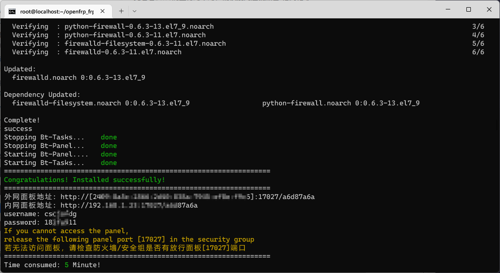

# 前言

很古早的时候我买了一台 树莓派 4B 4GB 版本（怀念当时 4GB 版本 500 块的日子）

由于 Cortex-A72 处理器，树莓派 4B 的性能其实很薄弱，当时我也只是勉强用它跑一跑 QQ 机器人和网站服务器。（宝塔跑 Mariadb 安装 CPU 占用率都能 100%）随后用旧电脑刷服务器后树莓派就闲置了。

最近有朋友想尝试在家里搭建个人网站，我就把树莓派借给了他，但是尝试了很多个 Linux 发行版（Debian、Ubuntu）后宝塔+LNMP 环境还是无法安装成功，不是宝塔无法运行就是 Mysql 无法安装。

在查阅了互联网资料后，发现我用的最多的 Centos 也存在 Arm 版本，在使用这个发行版后安装宝塔和 LNMP 环境也变得顺利了，于是打算写一篇博客记录一下安装过程

# 准备工作

需要准备：

- 一台接入内网树莓派 4B
- 至少 16GB 的内存卡 + 读卡器 (USB3.0 最佳)
- 一台电脑
- 系统镜像
- Raspberry Pi Imager (可前往 [https://www.raspberrypi.com/software/](//www.raspberrypi.com/software/) 下载)

# 烧录镜像

其实 CentOS 7 为树莓派提供了专门的系统镜像，在[CentOS - Download](https://www.centos.org/download/)中给 Arm 架构的处理器提供了 [ARM64(aarch64)](//isoredirect.centos.org/altarch/7/isos/aarch64/) 和 [ARM32(armhfp)](//isoredirect.centos.org/altarch/7/isos/armhfp/) ，因为我的树莓派 4B 是 4GB 版本的，所以就选择了 ARM64 的版本

你可以在对应架构的下载界面中选择官方推荐的镜像下载地址，国内用户可以前往[NJU Mirror](http://mirror.nju.edu.cn/centos-altarch/7.9.2009/isos/aarch64/images)、[清华大学开源软件镜像站](https://mirrors.tuna.tsinghua.edu.cn/centos-altarch/7.9.2009/isos/aarch64/images/) 或 [北京外国语大学开源软件镜像站](https://mirrors.bfsu.edu.cn/centos-altarch/7.9.2009/isos/aarch64/images/) 下载

下载文件名带 `RaspberryPI` 的镜像

下载完毕后使用树莓派官方的烧录工具 Raspberry Pi Imager 烧录

插入读卡器，启动 Raspberry Pi Imager

选择操作系统->使用自定义镜像，选择刚才下载好的 CentOS 镜像，再选择要烧录的内存卡，点击**烧录**按钮即可开始烧录

> 若内存卡中已烧录其它系统，请擦除一遍后在进行烧录
>
> **注意 1**：烧录后内存卡中原存储文件将**永久**丢失，请及时备份！
>
> **注意 2**：烧录无需使用 Imager 的高级设置，若设置永久设置请清空后烧录

# 配置系统

等待烧录完成后即可取出内存卡插入树莓派内，插上电源与网线即可启动

使用 ssh 登录树莓派，默认用户名为`root`， 初始密码为`centos`

> ssh 连接命令: `ssh 用户名@主机IP`
>
> 登录后可使用`passwd`修改密码，请牢记修改后密码
>
> 若不清楚树莓派 IP 可进入路由器后台或使用[Advanced IP Scanner](https://www.advanced-ip-scanner.com/)扫描

进入系统后输入`df -h`查看各分区大小

使用`rootfs-expand`拓展系统空间

> **警告**：请务必拓展系统空间，否则可能导致空间过下使得宝塔安装失败

新系统启动后推荐将软件源改为国内镜像，具体请参考镜像站帮助文档，如[清华大学镜像站](https://mirrors.tuna.tsinghua.edu.cn/help/centos-altarch/)可运行以下命令一键换源

```
sudo sed -e 's|^mirrorlist=|#mirrorlist=|g' \
         -e 's|^#baseurl=http://mirror.centos.org/altarch/|baseurl=https://mirrors.tuna.tsinghua.edu.cn/centos-altarch/|g' \
         -e 's|^#baseurl=http://mirror.centos.org/$contentdir/|baseurl=https://mirrors.tuna.tsinghua.edu.cn/centos-altarch/|g' \
         -i.bak \
         /etc/yum.repos.d/CentOS-*.repo
```

最后，更新软件包缓存 `sudo yum makecache`

你也可以将系统语言设置为中文，设置方式如下：

1. 查看当前系统语言包 `locale`
2. 查看所有系统语言包 `locale -a`
3. 检查是否存在 `zh_CN` 开头的语言包
4. 使用 `nano /etc/locale.conf` 编辑 `/etc/locale.conf` 文件，将其中的**LANG**值改为`zh_CN.UTF-8`（若第三步中未找到`zh_CN.UTF-8`，可用其他`zh_CN`开头的语言包替换）
5. 使用`reboot`命令重启系统让修改生效

> 修改语言为中文后部分软件**可能存在未知错误**，若错误发生请按照第四步将**LANG**值改为`en_US.UTF-8`

# 安装宝塔面板

参考[宝塔官网-下载](https://www.bt.cn/new/download.html)使用 CentOS 安装脚本安装

`yum install -y wget && wget -O install.sh https://download.bt.cn/install/install_6.0.sh && sh install.sh`

> 请删除命令末尾 9 位字符串后运行命令
>
> **警告**: 请在纯净环境中安装宝塔面板，若你先前已安装其他 LNMP/LAMP 运行环境或先前宝塔面板安装失败请参考**一、烧录镜像**擦除内存卡并重新烧录系统后安装

稍等一段时间后宝塔面板将安装完成


