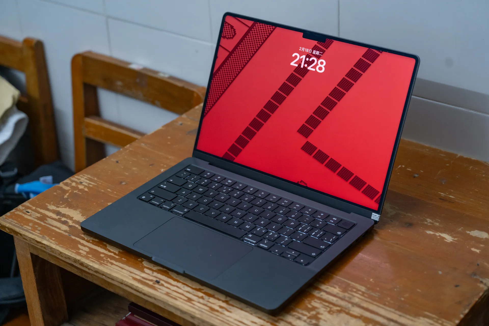
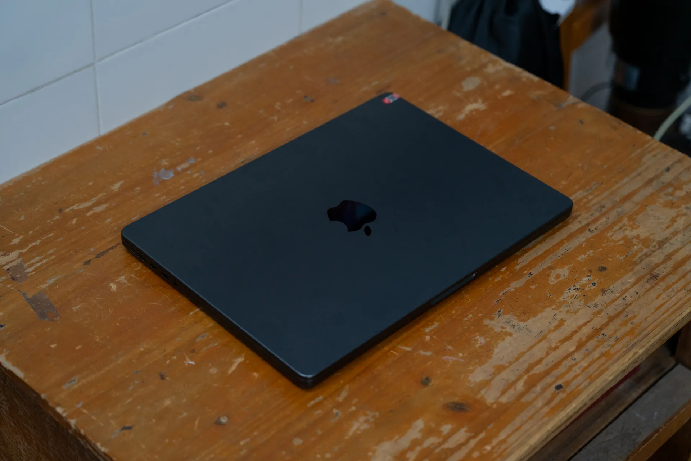

# 我家族没精神病史

买一台 Mac，很奇怪，是吗？

母胎到现在都是 Windows 的忠实用户，现在居然买了一台 MacBook Pro。

# 放下游戏，立地成佛

步入高中的最后一个学期，是时候认真学习啦！（是不是有点太晚了？）

我毅然决然地把魔霸给收起来了（放在另一个房间串流），下决心不再碰他。

可还是有一些照片编辑，文字处理（正如这篇博客）以及代码处理的需求，使用 iPad Pro 还是有些捉襟见肘，正巧我想体验下 macOS，就用压岁钱购买了这样一台电脑。

## 为什么是他

在国补后的 Mac Mini M4 和二手 MacBook Pro 之间我还是选择了 MacBook Pro，原因有很多。

查询资料可以发现，M3 Pro (11 Cores，下文若无特指不再标注) 的性能相较 M4 不相上下，这时候便可以关注其他的方面。

首先便是价格，M3 Pro 的 MacBook Pro 在红色二手平台 99 新 18+512 的售价为 8800 元出头，伴随着平台验机；而 M4 Mac Mini 的价格国补完最便宜的型号是 3600 元。看似 Mac Mini 更有性价比，但考虑到我的魔霸由于散热采用液金以及他的尺寸、续航的因素，使得他即使是笔记本我也不方便携带。而且相较与 Mac Mini 16+256 的配置，MacBook Pro 更是来到了 18+512 的起步，算上屏幕，我认为选择 MBP 是一个更好的选择。

