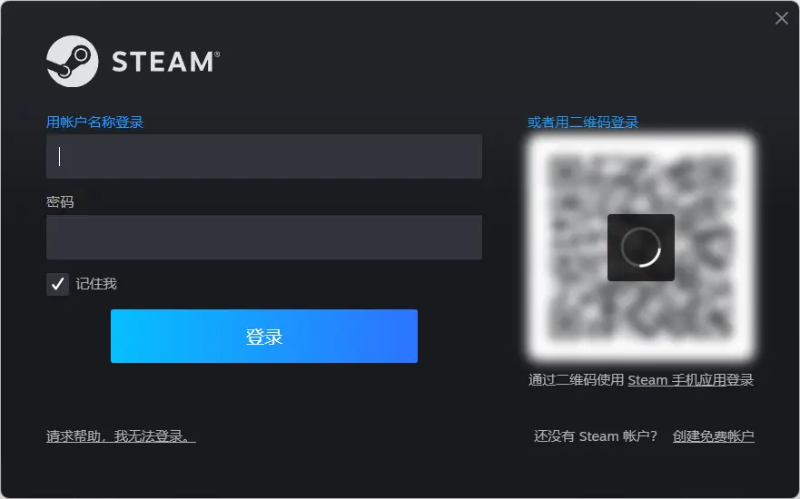

## 什么是 **Steam**

Steam 是 Valve 推出的电子游戏数字分发平台。Steam 集合了多种功能，如数字版权管理、游戏服务器匹配和反作弊系统，以及社交网络和游戏流媒体服务。Steam 还为用户提供自动更新游戏、游戏存档云存储，以及包括好友列表和游戏内聊天在内的社区功能。根据 CompareCamp2020 年统计，Steam 平台是全球最大的电脑游戏数字分发平台，占全球 50%-70%的电脑游戏下载量。 2003 年 9 月， Valve 将其作为一款软件客户端推出，提供自动更新游戏的功能，这一功能在 2005 年末扩展到了第三方游戏发行商发行的作品。

## 下载与安装

使用搜索引擎搜索 Steam 并进入域名为 [`https://store.steampowered.com/`](https://store.steampowered.com/) 的网站

> 请不要进入类似 **Steam 管家** 、 **Steam 助手** 之类的站点并认准官方域名
>
> 请务必检查站点域名，它一般在浏览器窗口的上方。

> 注：商城页面所显示语言可能与您计算机的语言与所在地区有关，请以实际情况为准

点击右上角绿色的 **安装 Steam** 按钮以前往 Steam 安装程序下载页面

点击蓝色的 **安装 STEAM** 按钮以下载安装程序

你应该可以在下载器的下载记录中找到名为 `SteamSetup.exe` 的可执行文件，运行这个可执行文件并按照提示进行相应的设置。

当安装程序提示 `Steam 已安装在你的操作系统`时，点击完成便可退出安装程序并完成安装。

> 请检查 Steam 的安装路径中是否带有中文。若有，请将其修改为不包含中文的路径。
>
> **错误**格式：`D:\软件\Steam\`
>
> **正确**格式：`D:\Software\Steam\`

> 通常软件会安装在系统盘符的 `Program Files` 或 `Program Files (x86)` 中，你一般可以放心地相信安装程序的默认路径。

## 运行并注册

安装完毕后，你可以在 **桌面** 或 **“开始”菜单** 中找到 Steam 的快捷方式，运行快捷方式即可启动 Steam。

> 若你点击完成前没有取消默认 **“运行 Steam”** 的复选框，安装程序会在关闭后自动打开 Steam。

运行后你可能要等待 Steam 进行更新。更新完毕后你就会进入 Steam 的登陆页面。

若你拥有 Steam 账户，你可以直接在其中登陆。（当然如果你有的话大概率也用不到这篇文章吧）。如果没有，你可以点击右下角 `创建免费账户` 来进入浏览器注册界面。

在注册页面根据提示填入你的**电子邮件地址**并重复以确认，在选择地区后进行人机验证，随后勾选 **`我已年满 13 周岁并同意《Steam 订户协议》和《Valve 隐私政策》的条款`**，点击 <b>继续</b> 进入下一步。

随后页面会提示你查看你的邮箱来完成验证，你需要进入你的邮箱来查看来自 Steam 的验证邮件。

登录你先前填写的电子邮箱，在**收件箱**中找到来自 Steam 的验证邮件，点击其中的点击 <b>验证我的电子邮件</b> 进行电子邮件验证。

> Steam 通常会使用域名为 `steampowered.com` 的邮箱给你发送地址，其他的地址均为假冒！
>
> **错误**格式：`noreply@steamguanfang.com`
>
> **正确**格式：`noreply@steampowered.com`

> 这一步通常需要你在浏览器中进行。

等待页面提示 **电子邮件已验证** 后返回 Steam 窗口中，并填写账户名称和密码。

> 账户名称为此后登录 Steam 时重要凭证，不可更改或与他人重复。

> 两次输入的密码需相同。

随后点击 <b>完成</b> 即可结束 Steam 账户注册。

## 登录桌面客户端

在登录界面键入你注册时填写的用户名与密码，点击登录。若初次登陆 Steam 可能会要你输入验证码以验证账户所有权。

登录你的电子邮件，将获取的验证码填入验证窗口即可完成登录。

## Q&A

### Q1: 连接 Steam 登录或注册时提示网络错误

你可下载 [Watt Toolkit（原 Steam++）](https://steampp.net/) 或 [UU 加速器](https://uu.163.com/) 来修复部分地区无法连接 Steam 服务器的问题。

### Q2: 新账号无法添加 Steam 好友

你需要在 Steam 商店中消费满 5 美元才可解锁好友功能。
